远景ID:无限未知

# 介绍
众所周知，dq77kb是一块神板，双千兆网口，itx大小，支持AMT远程管理。可以用来制作软路由，虚拟机亦或者是黑苹果。最近在远景论坛摸爬滚打了一段时间，看到dq77kb的板子几乎没人发过相关的、比较详细的帖子，我作为一位半小白，献丑一波，顺便当做自己的EFI存档仓库，以前折腾的乱，都不知道修改了哪里，哪个EFI存档适合哪个mac版本。由于半小白，文中有哪些错误和疏漏，敬请指正。

# 更新日志
暂无

# 配置
```shell
处理器：i5 3475s
主板：dq77kb
内存：ddr3 1600  8g*2
硬盘：浦科特msata128g
显卡：HD4000
无线网卡：DW1510又名BCM94322HM8L
有线网卡：
	红 intel 82579LM   
	黑 intel 82574L
蓝牙：绿联USB蓝牙适配器
BIOS版本：0061
clover版本：r5096
hackintosh版本：10.15.1
```
# BIOS设置
先把BISO恢复到默认设置

- 关闭串口，将configuration/onboard devices/serial prot修改为disable
- 禁用 VT-d，将secuity/intel vt directed i/o修改为disable
- 确保BIOS快速启动与安全启动关闭，显存大于128mb，SATA mode为AHCI，一般dq77kb恢复默认即可

# 效果
1.显卡HD4000完全驱动，按照黑果小兵大大的hackintool教程，显存提升为2048MB，链接：https://blog.daliansky.net/Intel-FB-Patcher-tutorial-and-insertion-pose.html

2.声卡采用APPLEALC仿冒，注入ID 1，音质音量都不错。

3.cpu睿频从1200 MHz到3600 MHz，一共9档。SSDT.aml负责变频，升级时记得保留。

4.电源睡眠唤醒，关闭了串行端口，并采用aishaoquan的帖子修改了kext版本，链接：http://bbs.pcbeta.com/viewthread-1834149-1-1.html

5.有线网卡支持。但有问题如下：

若采用IntelMausiEthernet.kext，则只能驱动红色网口，网速正常显示。若采用AppleIntelE1000e.kext，可以驱动双网口，但是网速只显示上行，下载速度始终为0。两种网卡驱动我都放在kext/备份下。默认使用IntelMausiEthernet.kext。

6.无线网卡DW1510免驱，局域网互拷速度30MB/S。

7.蓝牙CSR8510免驱。由于没有iphone，无法测试互传。

8.USB3.0和2.0正常，依照黑果小兵大大的教程定制USB，链接：https://blog.daliansky.net/Intel-FB-Patcher-USB-Custom-Video.html

# 配置图
  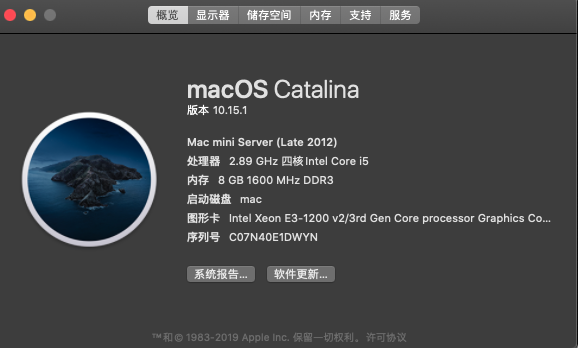
	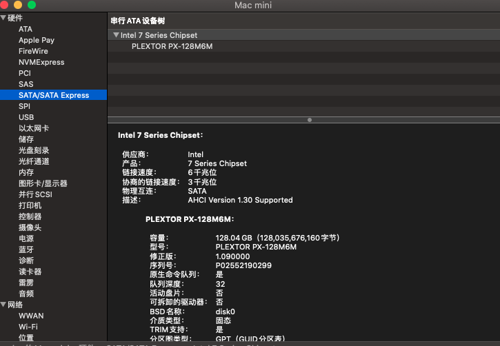
	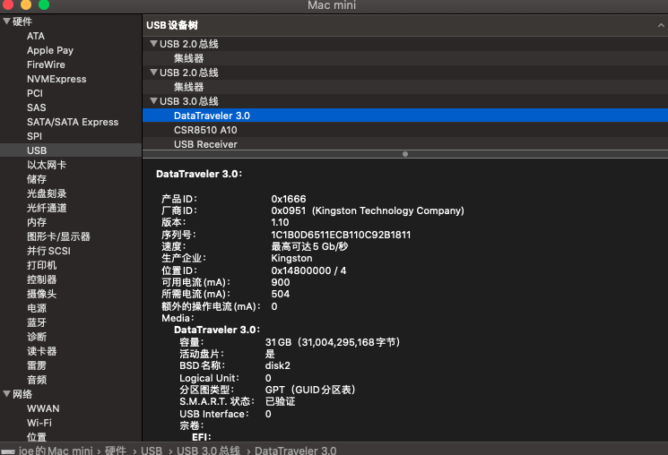
	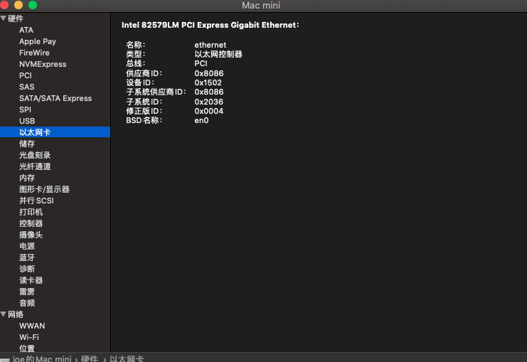
	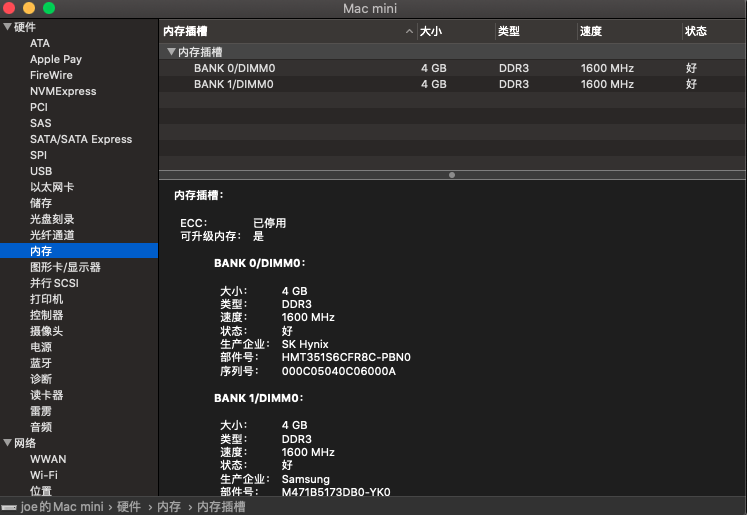
	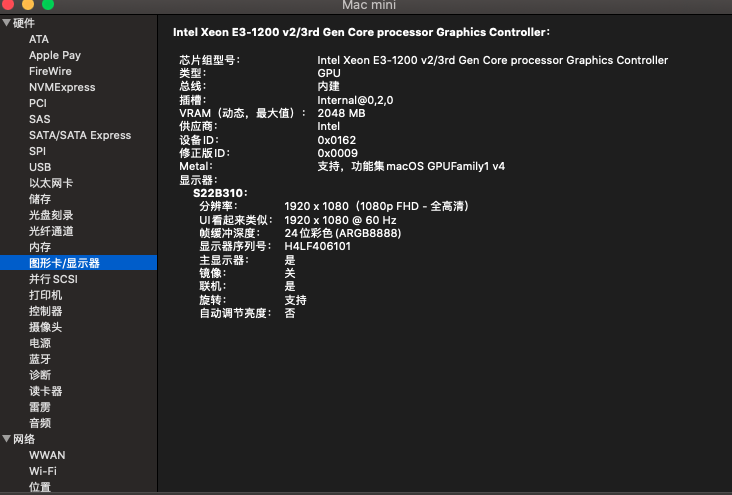
	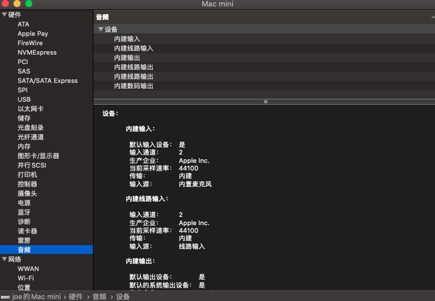
	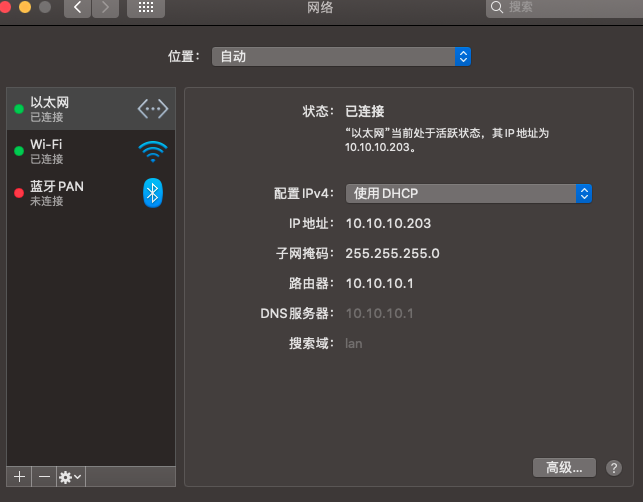
	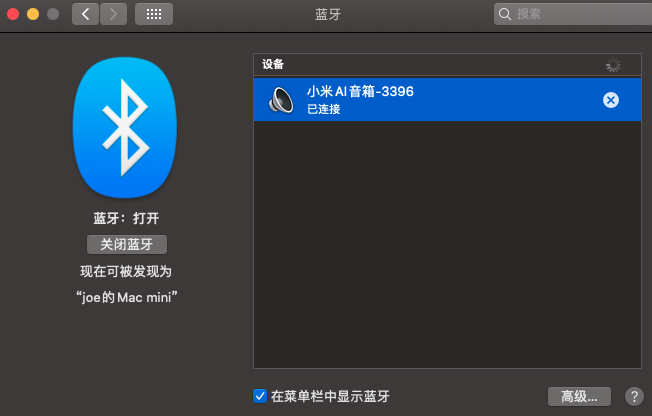
	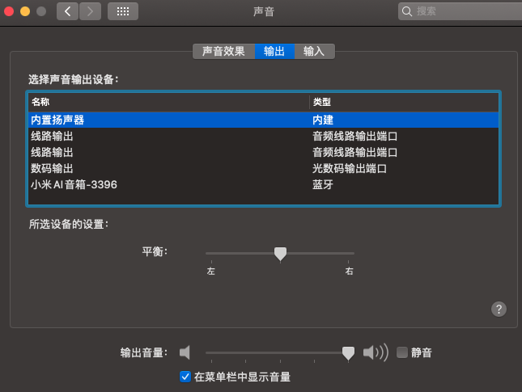
	
	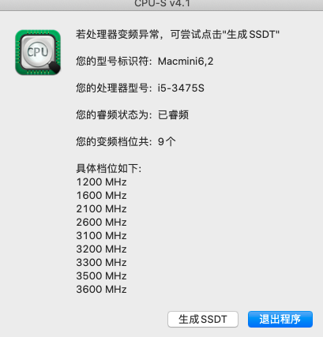
	
